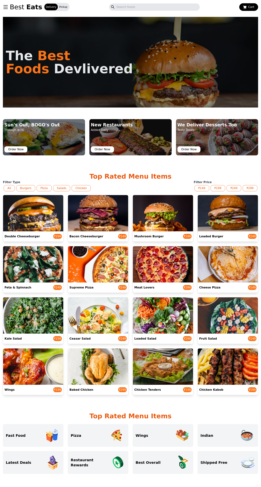

# Food-starter  Website


Welcome to the Food-starter  Website project! 🍔🌐

## Table of Contents
- [About](#about)
- [Features](#features)
- [Tech Stack](#tech-stack)
- [Installation](#installation)


This project is a modern and user-friendly food-starter  website built with React and styled using Tailwind CSS. It provides a seamless and visually appealing experience for users to explore, search, and filter through a diverse range of food options.

## Features

- **Modern Design**: A sleek interface designed for a seamless user experience.
- **Smart Filtering**: Advanced filtering options for quick and efficient searches.
- **Responsive & Fast**: Ensures a smooth and lightning-fast browsing experience across devices.
- **Secure Transactions**: Implements secure payment gateways for trustworthy transactions.
- **Analytics Integration**: Gathers insights into user behavior for data-driven improvements.
- **Collaborative Effort**: Developed with collaboration from [mention any collaborators or teams].

## Tech Stack

- React: For dynamic and interactive components.
- Tailwind CSS: For clean and responsive styling.

## Installation

1. Clone the repository:

   ```bash
   git clone https://github.com/Hiteshbemal24/food-order-website.git
   ```
2. Install dependencies:
    ```
    cd food-order-website
    npm install

    ```
3. Run the development server:
 Open your browser and navigate to 'http://localhost:3000'
 Explore the food order website and enjoy!
